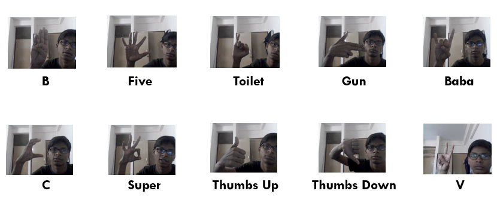
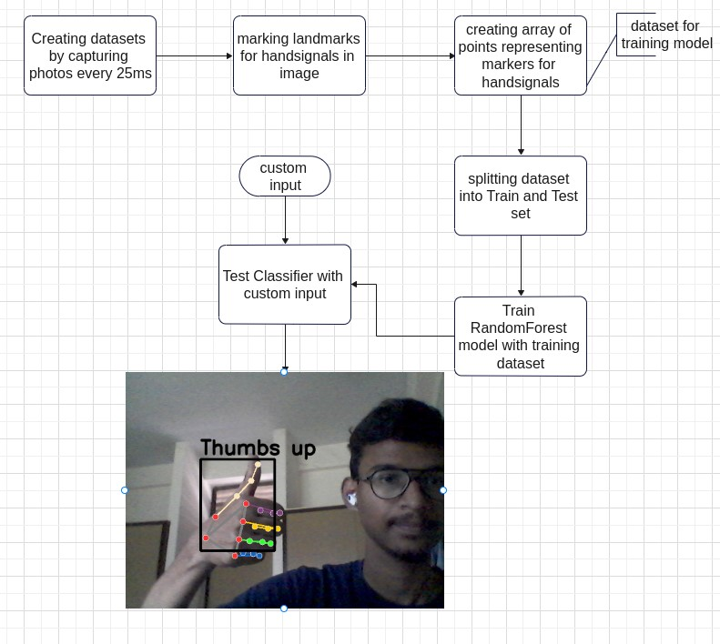

### Sign Language Detection
The project implements sign laguage detection with the help google mediapipe and random forest model.

### Execution Instructions
```bash
python test_classifier.py
```

### Sample Inputs


### Design

